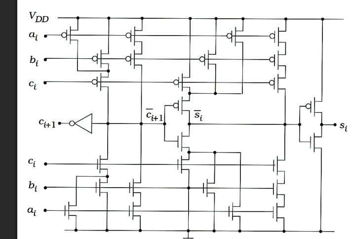
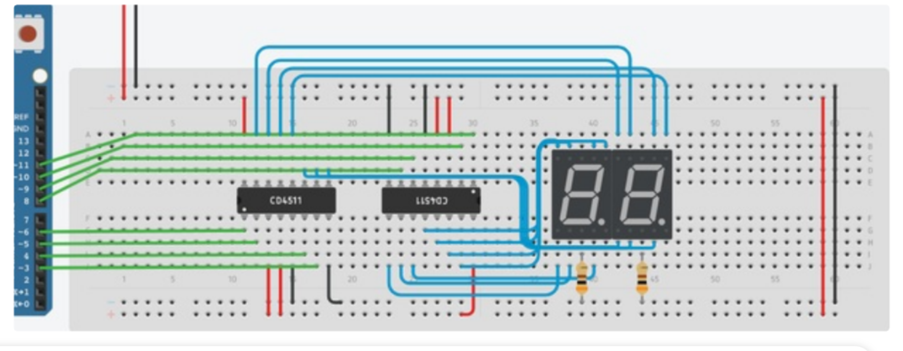

# Calculator Infinity

Хардуерен бинарен калкулатор, реализиран чрез CMOS пълен суматор (Full Adder), който събира две бинарни числа и визуализира резултата в десетичен вид върху два 7-сегментни дисплея.
Проектът комбинира нискониво цифрова логика с микроконтролерна обработка, демонстрирайки връзката между хардуерната електроника и програмирането.

# Информация за проекта

**Заглавие на проекта: Calculator Infinity**
Системен номер: #0069

**Възрастова група:**
Младша възрастова група

**Тематика**
Образователни технологии

**Участник:**
Александър Димитров

[**Линк към документацията**](https://docs.google.com/document/d/12Crm_2PY8XZTCjPWXc0VHsJXTKN4n1ZQQcyWSyu1qGQ/edit?tab=t.0)

Системата демонстрира:
- бинарна аритметика
- CMOS цифрова логика
- преобразуване бинарно → десетично
- BCD кодиране
- управление на 7-сегментни дисплеи

Проектът има образователна и практическа приложимост, като може да се използва за обучение по:
- цифрова електроника
- компютърна архитектура
- основи на бинарната математика

# Използван хардуер
- CMOS логическа схема (Full Adder архитектура)
- Arduino
- 2 × CD4511 BCD-to-7-segment драйверa
- 2 × 7-сегментни LED дисплея
- Breadboard
- Резистори
- Захранване 6V
- Свързващи проводници
- Подробният списък с компоненти се намира [тук](https://docs.google.com/spreadsheets/d/17rNvMx0YVMmPqwsUKWA4Ad5-7e4HS8Hky2FkBZKK_-o/edit?gid=835332160#gid=835332160).

# Схеми

